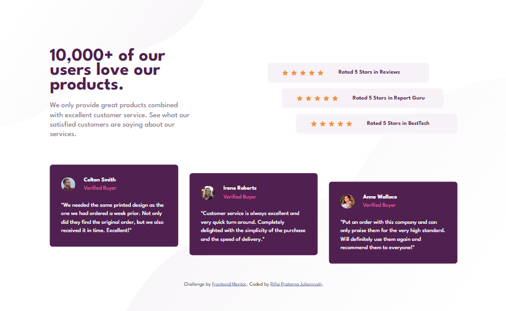

# Frontend Mentor - Social proof section solution

This is a solution to the [Social proof section challenge on Frontend Mentor](https://www.frontendmentor.io/challenges/social-proof-section-6e0qTv_bA). Frontend Mentor challenges help you improve your coding skills by building realistic projects. 

## Table of contents

- [Overview](#overview)
  - [The challenge](#the-challenge)
  - [Screenshot](#screenshot)
  - [Links](#links)
- [My process](#my-process)
  - [Built with](#built-with)
  - [What I learned](#what-i-learned)
  - [Useful resources](#useful-resources)
- [Author](#author)

## Overview

### The challenge

Users should be able to:

- View the optimal layout for the section depending on their device's screen size

### Screenshot

### Links

- Solution URL: [https://www.frontendmentor.io/solutions/social-proof-section-uRei7dvEcq](https://www.frontendmentor.io/solutions/social-proof-section-uRei7dvEcq)
- Live Site URL: [https://social-proof-frontendmentor-ten.vercel.app/](https://social-proof-frontendmentor-ten.vercel.app/)

## My process

### Built with

- Semantic HTML5 markup
- CSS custom properties
- Flexbox
- CSS Grid
- Mobile-first workflow
- SCSS/SASS

### What I learned

Learned about how using SASS/SCSS

### Useful resources

- [CSS Reset by Josh Comeau](https://www.joshwcomeau.com/css/custom-css-reset/) - This helped me for reset CSS

## Author

- Website - [Rifqi Pratama Juliansyah](https://www.rifqipratamaj.me/)
- Frontend Mentor - [@juliansyahrifqi](https://www.frontendmentor.io/profile/juliansyahrifqi)
- Twitter - [@juliansyahrifq1](https://www.twitter.com/juliansyahrifq1)

